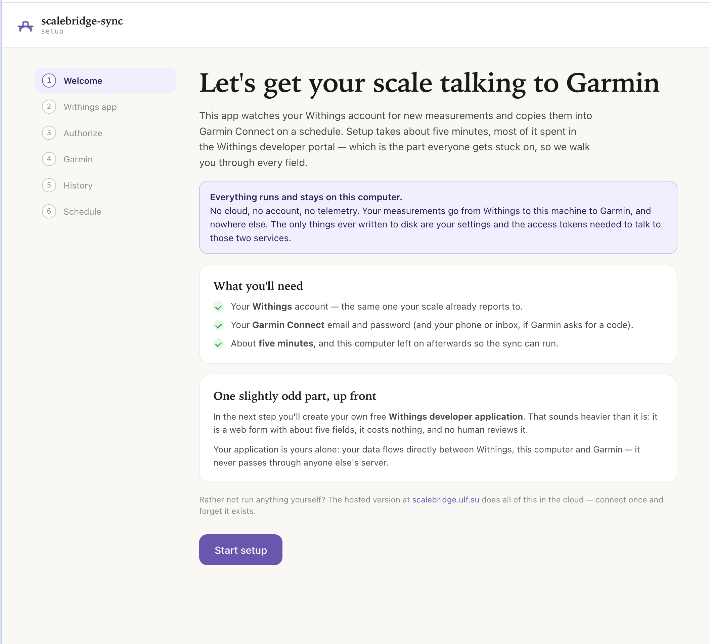

# scalebridge-sync

Sync your Withings scale to Garmin Connect, from your own computer. No cloud, no account, no telemetry. MIT licensed.

[](https://github.com/ulfdalen/scalebridge-sync/actions/workflows/ci.yml)
[](https://github.com/ulfdalen/scalebridge-sync/releases/latest)
[](https://hub.docker.com/r/ulfdalen/scalebridge-sync)
[](LICENSE)



## Three steps

**1. Start it.** With Docker:

```
docker run -d --name scalebridge-sync --restart unless-stopped \
  -p 127.0.0.1:8723:8723 -v scalebridge-sync:/data \
  ulfdalen/scalebridge-sync
```

Docker Desktop users can skip the terminal: the [image on Docker Hub](https://hub.docker.com/r/ulfdalen/scalebridge-sync/tags) has a **Run** button. Prefer compose? Grab [compose.yaml](compose.yaml) and run `docker compose up -d`. No Docker at all? [Download the binary](https://github.com/ulfdalen/scalebridge-sync/releases/latest) for your OS and run it — see [the full guide](DOCS.md#install).

**2. Set it up.** Open [http://localhost:8723](http://localhost:8723) and follow the wizard. You need your Withings account, your Garmin account, and about ten minutes — the wizard walks you through everything, including creating your personal free Withings developer app, with the exact values to paste at every step.

**3. Done.** Step on the scale — the weigh-in appears in Garmin Connect within minutes: weight, body fat, muscle mass, bone mass, hydration. The container keeps syncing in the background and survives reboots.

## Rather not keep a computer running?

This app must be running for syncs to happen. If you'd rather not leave a machine on, [**ScaleBridge**](https://scalebridge.ulf.su) is the hosted version by the same author: the same sync engine running around the clock, connected in two minutes, with a free manual-sync tier and a small yearly fee for fully automatic sync. Self-host for free, or let [scalebridge.ulf.su](https://scalebridge.ulf.su) handle it — same engine either way.

## Full guide

Everything else lives in **[DOCS.md](DOCS.md)**: install options (binaries, `go install`, running as an OS service), Docker details, the Withings developer app walkthrough, the security model, how the sync works, the CLI reference, and troubleshooting.

## Support the project

If this saved you some typing, you can [buy me a coffee](https://buymeacoffee.com/ulfdalen) — or try the hosted version at [scalebridge.ulf.su](https://scalebridge.ulf.su), which keeps this project maintained.

[](https://buymeacoffee.com/ulfdalen)

## License

MIT. See [LICENSE](LICENSE).
